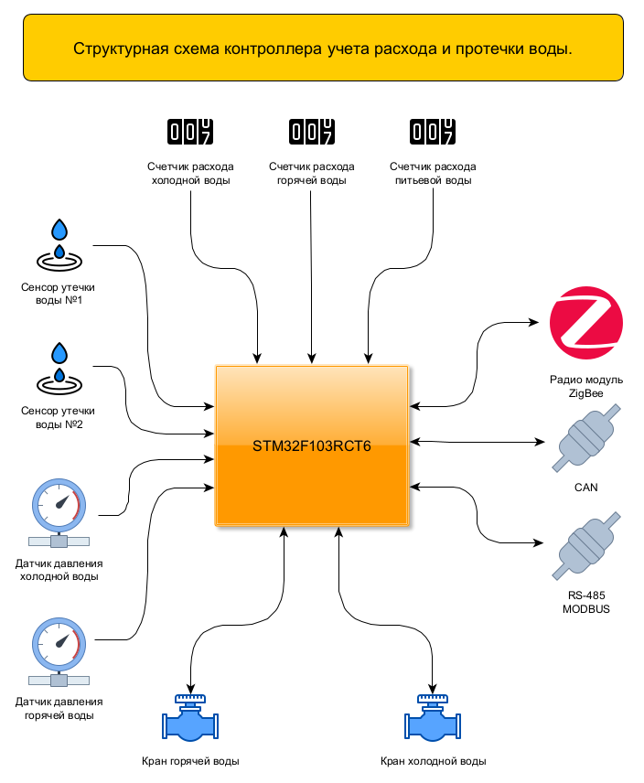
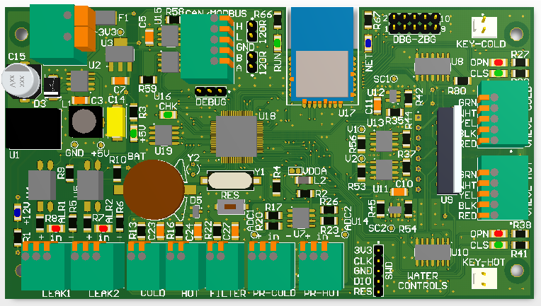
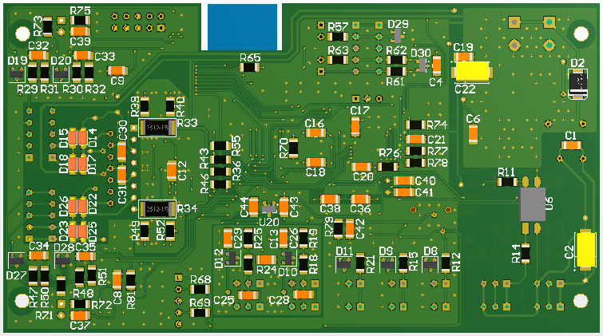

### Контроллер учета расхода и утечки воды.
---

##### Основные функции:
* Подсчет расхода воды с водомеров; 
* Контроль утечки воды;
* Контроль давления воды;
* Управление электроприводами кранов подачи воды от основного контроллера;
* Ручное управление электроприводами кранов подачи воды;
* Интервальное хранение показаний учета расхода воды;
* Регистрация в журнале событий утечки воды.
---



##### Каналы обмена данными:
* RS-485 (Modbus Slave);
* CAN;
* Zigbee.
---

##### Описание функционала:
* Подсчет расхода воды выполняется по трем отдельным каналам (холодная, горяча и питьевая вода). Для каждого канала, в настройках, задается значение инкремента при подсчете расхода воды от импульсного выхода счетчика, тип импульсного выхода: «сухой контакт»;
* Контроль утечки воды выполняется по двум отдельным каналам с помощью датчиков типа: Neptun SW003 или аналогичных. Питание датчиков осуществляется от встроенного, гальванически изолированного, источника питания постоянного тока 12В. При срабатывании датчиков утечки происходит автоматическое перекрытие воды и передача сообщения координатору сети. Восстановление подачи воды выполняется с помощью кнопок ручного управления или командами от основного контроллера;
* Контроль давления воды выполняется по двум каналам (холодная, горяча вода). Для измерения давления необходимо использовать датчик избыточного (относительного) давления с напряжением питания 5В и аналоговым выходом 0 – 5В. Есть возможность установки минимального и максимального выходного напряжения датчиков давления;
* Два канала управление электроприводами типа: CR501 по пяти проводной схеме подключения;
* Хранение показаний текущего расхода воды и журнала событий выполняется в энергонезависимой памяти типа FRAM (Ferroelectric RAM);
* В журнале событий записываются ежесуточные показания счетчиков и дата/время обнаружения события утечки воды. В журнале могут хранится до 63 событий (возможно увеличение глубины хранения). Доступ к событиям в журнале выполнятся с сортировкой по убыванию дата + время события;
* Настройка параметров контроллера выполняется с помощью консольных команд, интерфейс обмена: RS-232. Для подключения контроллера к ПК необходим конвертер уровней сигналов RS-232/TTL. Скорость обмена по умолчанию: 115200 (8N1);
* CAN интерфейс может быть сконфигурирован для 11 и 29 адресации, доступные скорости обмена: 10,20,50,125,250,500 (kbit/s). Перечень доступных регистров [тут](Doc/can_data.pdf);
* Modbus интерфейс может быть сконфигурирован под нужный адрес и скорость обмена (600 - 115200 baud). Перечень доступных регистров [тут](Doc/modbus_data.pdf);

---

##### Набор консольных команд:

```plaintext
date [dd.mm.yy]                 - Display/set date.
time [hh:mm[:ss]]               - Display/set time.
dtime                           - Display date and time.
valve [cold/hot opn/cls]        - Status, valve drive control.
stat                            - Statistics.
fram [N][clr/chk/test]          - FRAM HEX dump, clear, testing.
zb [res/init/net/save/cfg/chk]  - ZigBee module control.
water [cold/hot/filter/log [N]] - Water flow status, setting initial values.
config                          - Display of configuration parameters.
config save                     - Save configuration settings.
config {cold/hot/filter} xxxxx  - Setting incremental values for water meters.
config uart xxxxx               - Setting the speed baud (600 - 115200).
config modbus speed xxxxx       - Setting the speed baud (600 - 115200).
config modbus id xxxxx          - Setting the device ID on the modbus.
config can id xxxxx             - Setting the Device ID on the CAN Bus.
config can addr xxxxx           - Setting the width of the CAN bus identifier (11/29 bits).
config can speed xxxxx          - Set the CAN bus speed 10,20,50,125,250,500 (kbit/s).
config pres_max xxxxx           - Set the maximum pressure for the sensor.
config pres_omin xxxxx          - Setting the minimum output voltage of the pressure sensor.
config pres_omax xxxxx          - Setting the maximum output voltage of the pressure sensor.
config panid 0x0000 - 0xFFFE    - Network PANID.
config netgrp 1-99              - Network group number.
config netkey XXXX....          - Network key.
config devnumb 0x0001 - 0xFFFF  - Device number on the network.
config gate 0x0000- 0xFFF8      - Gateway address.
version                         - Displays the version number and date.
?                               - Help.
```
Примеры использования команд.

**dtime** - вывод текущей даты и времени.
```plaintext
Date: 07.12.2022 Wed Time: 23:07:08
```
**date** - вывод текущей даты и установка даты.
```plaintext
Date: 07.12.2022 Wed
```
**time** - вывод текущего времени и установка времени.
```plaintext
Time: 22:22:54
```
**config** - вывод параметров настроек, установка параметров.
```plaintext
Reading parameters from flash memory: OK
----------------------------------------------------
UART speed: ......................... 115200
----------------------------------------------------
Cold water meter increment: ......... 1 liters/imp
Hot water meter increment: .......... 1 liters/imp
Increment of drinking water meter: .. 10 liters/imp
----------------------------------------------------
Maximum measured value of
 the pressure sensor: ............... 6.00 atm
Minimum voltage at
 the pressure sensor output: ........ 0.40
Maximum voltage at
 the pressure sensor output: ........ 4.50
----------------------------------------------------
CAN identifier: ..................... 0x00000550
CAN identifier bit length: .......... 29
CAN speed: .......................... 125 kbit/s
----------------------------------------------------
MODBUS device address: .............. 0x10
MODBUS speed: ....................... 19200
----------------------------------------------------
Network PANID: ...................... 0x0001
Network group number: ............... 0
Network key: ........................ 11131517191B1D1F10121416181A1C1D
```
**water** - вывод показаний по расходу воды и состояния датчиков.
```plaintext
Cold water meter values: ...... 0.006
Hot water meter values: ....... 0.010
Drinking water meter values: .. 0.100
Cold water pressure: .......... 0.0 atm
Hot water pressure: ........... 2.81 atm
Leakage sensor power check: ... OK
Leak sensor status #1: ........ OK
Leak sensor status #2: ........ OK
Address of the next log entry:  0x0000
```
**water log** - вывод событий из журнала.
```plaintext
Records uploaded: 63

ALARM #01 (0x0200): 13.11.2022 21:34:50
----------------------------------------------------
Cold:  ........... 0.219  Pressure: ... 3.0
Hot: ............. 0.220  Pressure: ... 3.0
Filter: .......... 2.190
Valve cold: ...... UNDEF OK
Valve hot: ....... UNDEF OK
DC12V: ........... OK 
Leak sensor #1: .. OK 
Leak sensor #2: .. OK 

Event #02 (0x01E0): 12.11.2022 17:28:20
----------------------------------------------------
Cold:  ........... 0.219  Pressure: ... 0.6
Hot: ............. 0.220  Pressure: ... 0.6
Filter: .......... 2.190
Valve cold: ...... UNDEF OK
Valve hot: ....... UNDEF OK
DC12V: ........... OK 
Leak sensor #1: .. OK 
Leak sensor #2: .. OK 
```
**task** - вывод перечня задач RTOS и их состояния (доступно только для отладочной версии).
```plaintext
   Name thread     Priority  State      Stack Unused
----------------------------------------------------
 1 Command             24    Running        0   106
 2 Tmr Svc              2    Ready          0   197
 3 IDLE                 0    Ready          0   118
 4 Chk                 24    Blocked        0    10
 5 Led                 24    Blocked        0    96
 6 Key                 24    Blocked        0    38
 7 CanRecv             24    Blocked        0    50
 8 CanSend             24    Blocked        0    44
 9 Modbus              24    Blocked        0    80
10 ZBCtrl              24    Blocked        0    96
11 ZBFlow              24    Blocked        0   132
12 Water               24    Blocked        0    70
13 Uart                24    Blocked        0    52
14 Valve               24    Blocked        0    84
----------------------------------------------------
Free heap size: 792 of 10240 bytes.
```
**version** - вывод номеров и дат версий.
```plaintext
FirmWare version: .... 1.0.142.D
FirmWare date build: . 07.11.2022
FirmWare time build: . 23:08:40

The HAL revision: .... 1.1.8.0
Kernel Information: .. FreeRTOS V10.0.1
Kernel Version: ...... 10.0.1
Kernel API Version: .. 10.0.1
```
**valve** - вывод состояния (управление) актуаторами кранов подачи воды.
```plaintext
Cold water tap drive status: .. UNDEF
Cold water valve error: ....... OK
Hot water tap drive status: ... OPEN
Hot water valve error: ........ OK
```
**zb cfg** - управление радио модулем, вывод текущей конфигурации.
```plaintext
Device type ........................... Terminal
Network state ......................... Network exists
Network PAN_ID ........................ 0x0001
Network key ........................... 11131517191B1D1F10121416181A1C1D
Network short address ................. 0x7B40
MAC address ........................... 82 F8 03 18 00 4B 12 00 
Network short address of father node .. 0x0000
MAC address of father node ............ C3 3A 40 24 00 4B 12 00 
Network group number .................. 1
Communication channel ................. 11
TX power .............................. 4.5/20/27 dbm
Sleep state ........................... 0
```
**zb cfg** - проверка параметров радио модуля.
```plaintext
ZB: read config ... OK
ZB: parameters match.
```
**stat** - вывод статистики по интерфейсам связи.
```plaintext
Source reset: PINRST SFTRST 
Date/time of activation: 07.12.2022  23:08:08

Modbus statistics ...
----------------------------------------------------
Total packages recv .........................      0
Function code not supported .................      0 
Data address not available ..................      0 
Invalid value in data field .................      0 
Unrecoverable error .........................      0 
It takes time to process the request ........      0 
Busy processing command .....................      0 
The slave cannot execute the function .......      0 
Memory Parity error .........................      0 
Received packet checksum error ..............      0 
The request is addressed to another device ..      0 
Errors in function call parameters ..........      0 

CAN statistics ...
----------------------------------------------------
Total packages recv .........................      0
Total packages send .........................      0
Protocol Error Warning ......................      0 
Error Passive ...............................      0 
Bus-off error ...............................      0 
Stuff error .................................      0 
Form error ..................................      0 
Acknowledgment error ........................      0 
Bit recessive error .........................      0 
Bit dominant error ..........................      0 
CRC error ...................................      0 
Rx FIFO0 overrun error ......................      0 
Rx FIFO1 overrun error ......................      0 
TxMailbox 0 failure due to arbitration lost .      0 
TxMailbox 0 failure due to transmit error ...      0 
TxMailbox 1 failure due to arbitration lost .      0 
TxMailbox 1 failure due to transmit error ...      0 
TxMailbox 2 failure due to arbitration lost .      0 
TxMailbox 2 failure due to transmit error ...      0 
Timeout error ...............................      0 
Peripheral not initialized ..................      0 
Peripheral not ready ........................      0 
Peripheral not started ......................      0 
Parameter error .............................      0 

ZigBee statistics ...
----------------------------------------------------
Total packages recv .........................      0
Total packages send .........................      0
Error in command data .......................      0 
UART transmission error .....................      0 
Module no running ...........................      0 
No network ..................................      0 
Command undefined ...........................      0 
Timed out for response ......................      0 
Data error ..................................      0 
No confirmation of receipt of data ..........      0 
Checksum error ..............................      0 
Device number error .........................      0 
Device address error ........................      0 
```
**fram** - вывод дампа энергонезависимой (FRAM) памяти в формате HEX.
```plaintext
0x0000: 4F 00 00 00 50 00 00 00  16 03 00 00 00 00 E0 00  O...P...........
0x0010: 05 0B 0B E6 07 16 0B 33  00 00 00 00 00 00 6E F6  .......3......n.
0x0020: 01 1D 15 0B 0B E6 07 00  20 41 00 00 00 41 00 00  ........ A...A..
0x0030: 00 94 02 00 00 D8 00 D8  00 80 00 00 00 00 94 43  ...............C
0x0040: 01 1F 15 0B 0B E6 07 00  20 43 00 00 00 43 00 00  ........ C...C..
0x0050: 00 A8 02 00 00 D7 00 D8  00 80 00 00 00 00 87 0E  ................
0x0060: 01 21 15 0B 0B E6 07 00  20 45 00 00 00 45 00 00  .!...... E...E..
0x0070: 00 BC 02 00 00 D8 00 D9  00 80 00 00 00 00 E3 C3  ................
0x0080: 01 27 15 0B 0B E6 07 00  20 49 00 00 00 4A 00 00  .'...... I...J..
0x0090: 00 E4 02 00 00 D9 00 D9  00 80 00 00 00 00 48 70  ..............Hp
0x00A0: 01 29 15 0B 0B E6 07 00  20 4B 00 00 00 4C 00 00  .)...... K...L..
0x00B0: 00 F8 02 00 00 D9 00 D9  00 80 00 00 00 00 27 65  ..............'e
0x00C0: 01 2B 15 0B 0B E6 07 00  20 4D 00 00 00 4E 00 00  .+...... M...N..
0x00D0: 00 0C 03 00 00 D9 00 D8  00 80 00 00 00 00 C3 16  ................
0x00E0: 00 00 00 00 00 00 00 00  00 00 00 00 00 00 00 00  ................
0x00F0: 00 00 00 00 00 00 00 00  00 00 00 00 00 00 00 00  ................
```
**fram chk** - проверка блоков данных в энергонезависимой (FRAM) памяти.
```plaintext
Checking FRAM data ...
Address: 0x0000 ... OK
Address: 0x0020 ... OK
Address: 0x0040 ... OK
Address: 0x0060 ... OK
Address: 0x0080 ... OK
Address: 0x00A0 ... Block free
Address: 0x00C0 ... Block free
...
...
...
Address: 0x07C0 ... Block free
Address: 0x07E0 ... Block free
OK
```
**flash** - вывод дампа FLASH памяти в формате HEX - параметры контроллера (доступно только для отладочной версии).
```plaintext
0x0803F800: 01 00 01 00 0A 00 00 00  C0 40 CD CC CC 3E 00 00  .........@...>..
0x0803F810: 90 40 50 05 00 00 01 03  06 10 0B 01 00 11 13 15  .@P.............
0x0803F820: 17 19 1B 1D 1F 10 12 14  16 18 1A 1C 1D 01 00 00  ................
0x0803F830: 00 00 00 00 00 00 00 00  00 00 00 00 00 00 00 00  ................
0x0803F840: 00 00 00 00 00 00 00 00  00 00 00 00 00 00 00 00  ................
0x0803F850: 00 00 00 00 00 00 00 00  00 00 00 00 00 00 00 00  ................
0x0803F860: 00 00 00 00 00 00 00 00  00 00 00 00 00 00 00 00  ................
0x0803F870: 00 00 00 00 00 00 00 00  00 00 00 00 00 00 E0 27  ...............'
```




